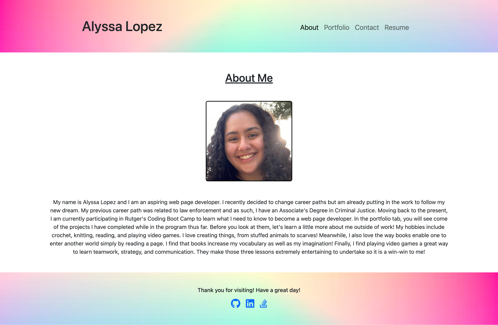

# My-Portfolio
## Description
These files come together to create my portfolio!

## Table of Contents
- [Installation](#installation)
- [Usage](#usage)
- [Some Problems](#some-problems)
- [Deployed Application](#deployed-application)

## Installation *
Download these files from this GitHub Repository and then type `npm i` in your terminal for the folder with said files. You should now be good to run the code!

## Usage *
Type `npm start` into the same terminal you used for the installation. Then, browse my portfolio!

## Deployed Application
Here is a screenshot of the deployed application:

Here is the link to the deployed application:

<a href="https://alylopez02.github.io/My-Portfolio/">https://alylopez02.github.io/My-Portfolio/</a>

----------
#### * It is recommended that you simply browse the deployed application.
